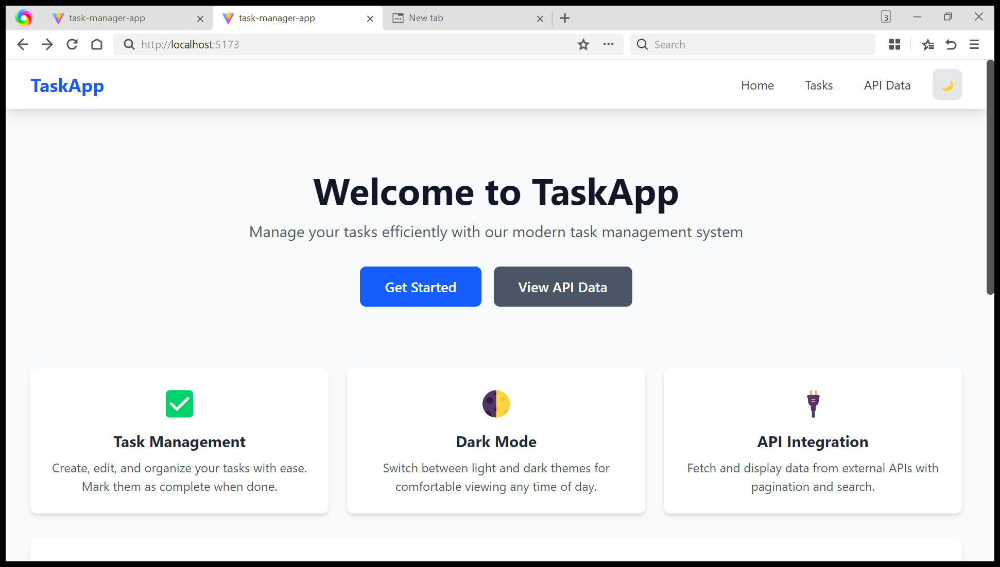
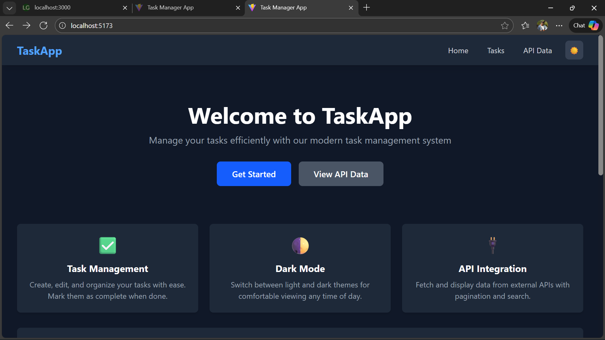
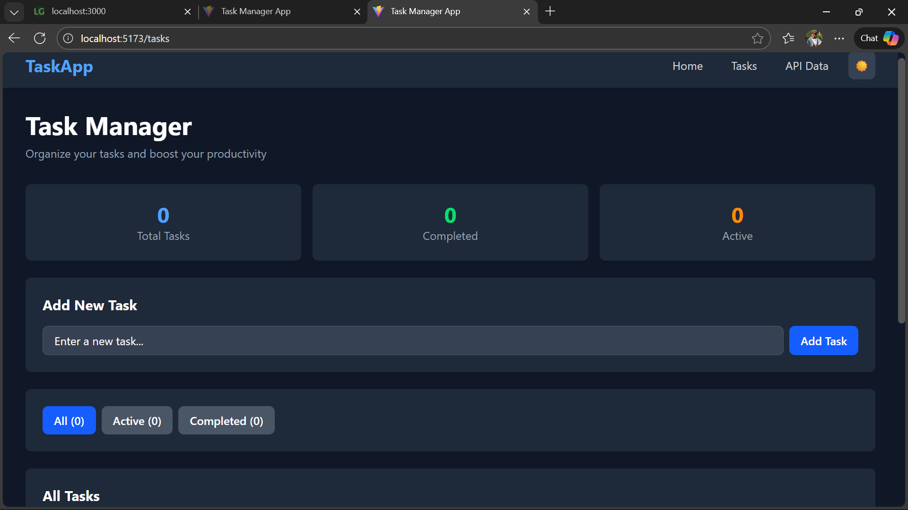
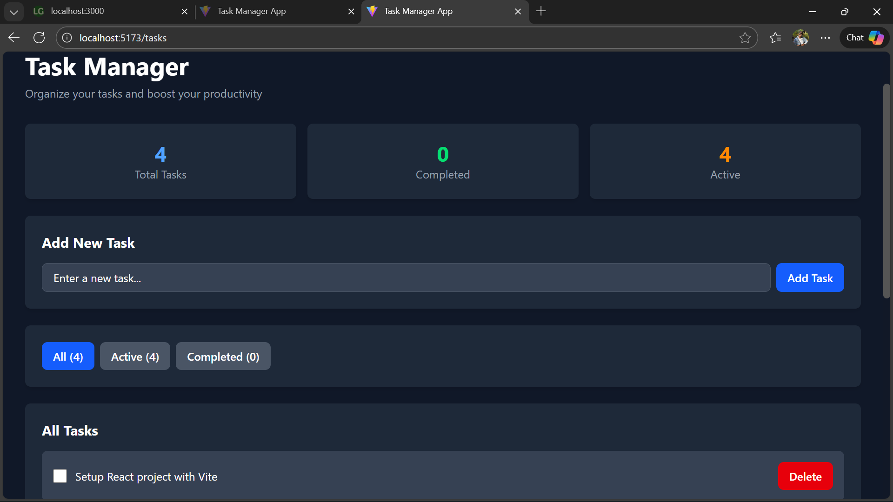
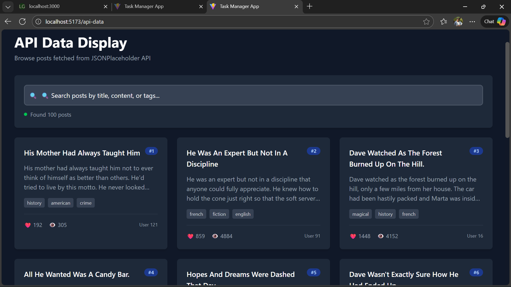

# 🎨 Task Manager App - React.js, JSX, and Tailwind CSS

A modern, responsive task management application built with React.js, Vite, and Tailwind CSS. This project demonstrates component architecture, state management, hooks usage, API integration, and responsive design principles.


## 📋 Table of Contents

- [Project Overview](#project-overview)
- [Features Implemented](#features-implemented)
- [Technologies Used](#technologies-used)
- [Setup Instructions](#setup-instructions)
- [Project Structure](#project-structure)
- [Components Documentation](#components-documentation)
- [API Documentation](#api-documentation)
- [Screenshots](#screenshots)
- [Deployment](#deployment)
- [Author](#author)

---

## 🚀 Project Overview

This project is a full-featured task management application that allows users to create, manage, and organize their tasks efficiently. It includes API integration to fetch and display data from external sources, implements dark/light theme switching, and provides a seamless user experience across all devices.

### Key Highlights:
- ✅ Component-based architecture with reusable UI components
- ✅ State management using React Hooks (useState, useEffect, useContext)
- ✅ Custom hooks for localStorage persistence
- ✅ RESTful API integration with error handling
- ✅ Responsive design with Tailwind CSS
- ✅ Dark/Light theme support
- ✅ Task filtering and search functionality
- ✅ Pagination for API data

---

## ✨ Features Implemented

### Task 1: Project Setup ✓
- [x] React application created using Vite
- [x] Tailwind CSS installed and configured
- [x] Proper project structure with organized folders
- [x] React Router configured for navigation

### Task 2: Component Architecture ✓
- [x] **Button Component**: Three variants (primary, secondary, danger)
- [x] **Card Component**: Flexible container for content display
- [x] **Navbar Component**: Responsive navigation with mobile menu
- [x] **Footer Component**: Site footer with links and copyright
- [x] **Layout Component**: Wraps pages with consistent header/footer

### Task 3: State Management and Hooks ✓
- [x] **TaskManager Component** with full CRUD functionality:
  - Add new tasks
  - Mark tasks as completed
  - Delete tasks
  - Filter tasks (All, Active, Completed)
- [x] **useState**: Managing component state
- [x] **useEffect**: Loading saved tasks on mount
- [x] **useContext**: Theme management (light/dark mode)
- [x] **Custom Hook**: `useLocalStorage` for data persistence

### Task 4: API Integration ✓
- [x] Fetch data from JSONPlaceholder API
- [x] Display data in responsive grid layout
- [x] Loading states with spinner animation
- [x] Error handling with retry functionality
- [x] Pagination implementation
- [x] Search/filter functionality

### Task 5: Styling with Tailwind CSS ✓
- [x] Fully responsive design (mobile, tablet, desktop)
- [x] Dark/Light mode theme switcher
- [x] Utility-first CSS approach
- [x] Custom animations and transitions
- [x] Accessible color contrast

---

## 🛠️ Technologies Used

- **React 18.3+** - Frontend library
- **Vite 7.1+** - Build tool and dev server
- **Tailwind CSS 4.0+** - Utility-first CSS framework
- **React Router DOM 7.0+** - Client-side routing
- **JavaScript (ES6+)** - Programming language
- **LocalStorage API** - Data persistence

---

## 📦 Setup Instructions

### Prerequisites

Make sure you have the following installed:
- **Node.js** (v18 or higher) - [Download here](https://nodejs.org/)
- **npm** (comes with Node.js)
- **Git** - [Download here](https://git-scm.com/)

### Installation Steps

1. **Clone the repository**
   ```bash
   git clone https://github.com/YOUR_USERNAME/react-js-jsx-and-css-mastering-front-end-development-Cdasilver29.git
   cd react-js-jsx-and-css-mastering-front-end-development-Cdasilver29
   ```

2. **Install dependencies**
   ```bash
   npm install
   ```

3. **Start the development server**
   ```bash
   npm run dev
   ```

4. **Open your browser**
   
   Navigate to `http://localhost:5173/`

### Build for Production

```bash
npm run build
```

This creates an optimized production build in the `dist/` folder.

### Preview Production Build

```bash
npm run preview
```

---

## 📁 Project Structure

```
task-manager-app/
├── public/                  # Static assets
├── src/
│   ├── components/          # Reusable UI components
│   │   ├── Button.jsx
│   │   ├── Card.jsx
│   │   ├── Navbar.jsx
│   │   ├── Footer.jsx
│   │   ├── TaskManager.jsx
│   │   └── ApiDataDisplay.jsx
│   ├── context/             # React Context providers
│   │   └── ThemeContext.jsx
│   ├── hooks/               # Custom React hooks
│   │   └── useLocalStorage.jsx
│   ├── layouts/             # Layout components
│   │   └── MainLayout.jsx
│   ├── pages/               # Page components
│   │   ├── Home.jsx
│   │   ├── Tasks.jsx
│   │   └── ApiData.jsx
│   ├── utils/               # Utility functions
│   ├── App.jsx              # Main App component
│   ├── main.jsx             # Entry point
│   └── index.css            # Global styles
├── .gitignore
├── package.json
├── tailwind.config.js       # Tailwind configuration
├── postcss.config.js        # PostCSS configuration
├── vite.config.js           # Vite configuration
└── README.md
```

---

## 🧩 Components Documentation

### Button Component
**Location**: `src/components/Button.jsx`

A reusable button component with multiple style variants.

**Props:**
- `children` (ReactNode): Button content
- `variant` (string): Style variant - 'primary' | 'secondary' | 'danger'
- `onClick` (function): Click handler
- `type` (string): Button type - 'button' | 'submit' | 'reset'
- `disabled` (boolean): Disabled state
- `className` (string): Additional CSS classes

**Usage:**
```jsx
<Button variant="primary" onClick={handleClick}>
  Click Me
</Button>
```

### Card Component
**Location**: `src/components/Card.jsx`

A flexible card container for displaying content.

**Props:**
- `children` (ReactNode): Card content
- `title` (string): Optional card title
- `hover` (boolean): Enable hover animation
- `className` (string): Additional CSS classes

**Usage:**
```jsx
<Card title="My Card" hover>
  <p>Card content goes here</p>
</Card>
```

### TaskManager Component
**Location**: `src/components/TaskManager.jsx`

Full-featured task management system with CRUD operations.

**Features:**
- Add tasks with text input
- Toggle task completion status
- Delete tasks
- Filter by All/Active/Completed
- Statistics display
- LocalStorage persistence

### useLocalStorage Hook
**Location**: `src/hooks/useLocalStorage.jsx`

Custom hook for persisting state in localStorage.

**Usage:**
```jsx
const [tasks, setTasks] = useLocalStorage('tasks', []);
```

---

## 🌐 API Documentation

### JSONPlaceholder API Integration

**Base URL**: `https://jsonplaceholder.typicode.com`

#### Endpoint Used:
```
GET /posts
```

**Response Format:**
```json
{
  "userId": 1,
  "id": 1,
  "title": "Post title",
  "body": "Post content..."
}
```

#### Features Implemented:
- ✅ Fetch all posts on component mount
- ✅ Loading state during API calls
- ✅ Error handling with user-friendly messages
- ✅ Search/filter functionality
- ✅ Pagination (10 posts per page)

---

## 📸 Screenshots

### Home Page

*Light mode home page*


*Dark mode home page*

### Task Manager

*Empty task list*


*Task list with active and completed tasks*

### API Data Display
 
*Posts fetched from JSONPlaceholder API*

---

## 🚀 Deployment

This project is deployed and accessible at:

**Live Demo**: [https://your-app-url.vercel.app](https://your-app-url.vercel.app)

### Deploy to Vercel

1. Install Vercel CLI:
   ```bash
   npm install -g vercel
   ```

2. Deploy:
   ```bash
   vercel
   ```

3. Follow the prompts to complete deployment

### Deploy to Netlify

1. Build the project:
   ```bash
   npm run build
   ```

2. Drag and drop the `dist/` folder to [Netlify Drop](https://app.netlify.com/drop)

### Deploy to GitHub Pages

1. Install gh-pages:
   ```bash
   npm install --save-dev gh-pages
   ```

2. Add to `package.json`:
   ```json
   "scripts": {
     "predeploy": "npm run build",
     "deploy": "gh-pages -d dist"
   }
   ```

3. Deploy:
   ```bash
   npm run deploy
   ```

---

## 👨‍💻 Author

**Calvine Mugunda (Cdasilver29)**

- GitHub: [@Cdasilver29](https://github.com/Cdasilver29)
- Project Repository: [View on GitHub](https://github.com/Cdasilver29/react-js-jsx-and-css-mastering-front-end-development-Cdasilver29)

---

## 📝 License

This project is part of a PLP Academy assignment and is for educational purposes.

---

## 🙏 Acknowledgments

- [React Documentation](https://react.dev/)
- [Tailwind CSS Documentation](https://tailwindcss.com/)
- [Vite Documentation](https://vitejs.dev/)
- [JSONPlaceholder](https://jsonplaceholder.typicode.com/) for the free API
- PLP Academy for the assignment structure

---

## 📅 Project Timeline

- **Week 3**: October 2025
- **Completed**: [Add completion date]
- **Assignment**: React.js, JSX, and Tailwind CSS – Mastering Front-End Development

---

## ✅ Checklist

- [x] Project setup with Vite
- [x] Tailwind CSS configuration
- [x] React Router setup
- [x] Reusable components created
- [x] State management implemented
- [x] Custom hooks developed
- [x] API integration completed
- [x] Responsive design
- [x] Dark/Light theme
- [x] README documentation
- [x] Screenshots added
- [x] Deployed to hosting platform
- [x] Submitted to GitHub Classroom

---

*Built with ❤️ using React, Vite, and Tailwind CSS*
